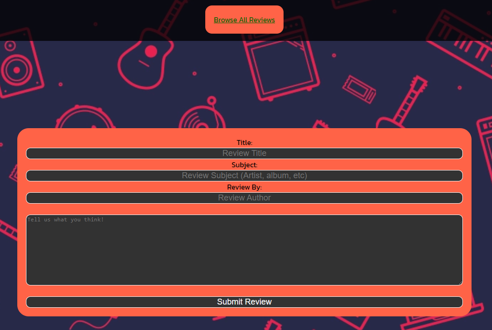

# **WeReview App**

## Introduction
Hi there! Thanks for checking out this repository for my *WeReview* app. This project was started as part of the General Assembly Software Engineering Immersive bootcamp. The idea was to create a platform for user-focused music reviews.

## Resources
Trello Board: https://trello.com/b/kUfwC0eI/wereview-app

Wireframe: https://wireframepro.mockflow.com/view/MOvpXdbNvob

ERD: https://lucid.app/lucidchart/e979197d-7dee-402e-9dab-a7f8025e91a3/edit?invitationId=inv_62e0f26f-992d-4afa-9b54-1038a9e50b6c

## REST Routes for Reviews ##

 Route | Action |     URL    | HTTP Verb |  View  |     Mongoose method     |
 :---: | :----: | :--------: | :-------: | :----: | :---------------------: |
   1   | Index  | /we-review/reviews      | GET       | IndexReviews  | Review.find()              |
   2   | Show   | /we-review/reviews/:id  | GET       | ShowReview   | Review.findByID()          |
   3   | New    | /we-review/reviews/new  | GET       | NewReview    | N/A                     |
   4   | Create | /we-review/reviews      | POST      | N/A    | Review.create()            |
   5   | Edit   | /we-review/reviews/:id/edit | GET   | EditReview   | Review.findbyID()          |
   6   | Update | /we-review/reviews/:id  | PUT       | N/A    | Review.findByIDAndUpdate() |
   7   | Delete | /we-review/reviews/:id  | DELETE    | N/A    | Review.findByIDAndDelete() |

## Technologies Used
* HTML
* CSS
* JavaScript
* Node.js
* MongoDB
* Mongoose
* Express
* React

## App Flow

### *View All Reviews ("/we-review/reviews")*
This page currently acts as the Index for the reviews.

### *Post a New Review ("/we-review/new")*
This page allows the user to post a new review to the site before redirecting them to the newly posted review. Currently there is no login functionality to post a review as an actual user tied to the database, and there is just a field for author.

### *View a Specific Review ("we-review/reviews/:id")*
A user is able to view a review by clicking on the link to it from the main reviews index page.

### *Edit Review ("we-review/reviews/:id/edit")*
A user is able to edit a review by clicking on the link within the individual review page. From the edit screen, the user may either make edits and submit their changes or delete the review entirely. Right now this is not locked to a specific user

## Next Steps
*WeReview* is a work in progress as I would still like to add more functionality including, but not limited to, user authentication/authorization features, the ability to like and comment on reviews, linking reviews to specific users, and connecting the app to the Spotify API for direct linking to the content being reviewed.